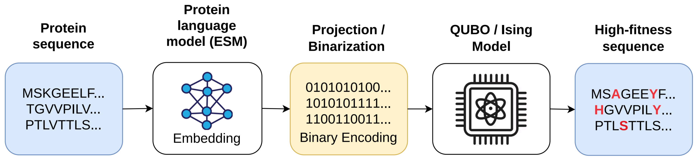

# Q-BioLat

Source code for the BIOKDD 2026 submission:

**Binary Latent Protein Fitness Landscapes for Quantum Annealing Optimization**



Q-BioLat models protein fitness landscapes in a binary latent space. Protein sequences are first embedded with a pretrained protein language model (ESM), then projected and binarized, and finally fit with a QUBO surrogate for combinatorial optimization. The paper is available here: 

## Repository layout

```text
Q-BIOLAT-main/
├── Q-BIOLAT.pdf                         # paper draft
├── README.md
├── setup.py
├── data/
│   └── proteingym/
│       ├── gfp.csv                      # full GFP benchmark used in the paper
│       ├── gfp_1000.csv
│       ├── gfp_2000.csv
│       ├── gfp_5000.csv
│       └── gfp_10000.csv
├── examples/
│   ├── download_proteingym_benchmarks.py
│   ├── make_subset_csv.py
│   ├── build_real_peptide_dataset_esm_dense.py
│   ├── project_binarize_embeddings.py
│   ├── pca_binarize_embeddings.py
│   └── ...
├── experiments/
│   ├── train_surrogate.py
│   ├── optimize_latent.py
│   ├── benchmark_multiseed.py
│   ├── aggregate_grid_results.py
│   ├── render_table1_surrogate.py
│   ├── render_table2_optimization.py
│   ├── render_table3_representation.py
│   ├── plot_figure1_latent_dimension.py
│   └── ...
├── scripts/
│   ├── run_gfp_pipeline.sh
│   ├── run_gfp_pca_pipeline.sh
│   ├── run_surrogate_and_optimization.sh
│   ├── run_multiseed_grid.sh
│   ├── aggregate_grid_results.sh
│   ├── table1.sh
│   ├── table2.sh
│   ├── table3.sh
│   └── figure1.sh
└── src/
    ├── data/
    ├── models/
    ├── optimization/
    └── utils/
```

## Environment setup

### 1. Create a Python environment

Python 3.9+ is recommended.

```bash
python -m venv .venv
source .venv/bin/activate
```

### 2. Install dependencies

```bash
pip install --upgrade pip
pip install -e .
pip install numpy pandas matplotlib scikit-learn requests torch transformers
```

Notes:

- `torch` and `transformers` are required for generating ESM embeddings.
- The paper experiments were run on CPU, but GPU can also be used by passing `--device cuda` to the embedding scripts.
- If you already have a Conda environment with PyTorch installed, that is also fine.

## Data

The repository already includes the ProteinGym GFP CSV used in the paper:

```text
data/proteingym/gfp.csv
```

If you want to redownload ProteinGym benchmark files, use:

```bash
python examples/download_proteingym_benchmarks.py
```

## Reproducing the paper results

The results in the paper are generated in five stages:

1. Build dense ESM embeddings and random-projection binary latents
2. Build PCA-based binary latents
3. Train QUBO surrogates and run optimization over the random-projection grid
4. Run multiseed optimization
5. Aggregate results and render tables / figures

### Stage 1. Build dense ESM embeddings and random-projection binary latents

This script:

- samples GFP subsets with sizes `1000, 2000, 5000, 10000`
- computes dense ESM embeddings once per subset
- creates binary latent datasets for dimensions `8, 16, 32, 64`

```bash
bash scripts/run_gfp_pipeline.sh
```

Outputs:

```text
artifacts/dense/gfp_<N>_dense.npz
artifacts/binary/gfp_<N>_esm_binary_<D>.npz
```

### Stage 2. Build PCA-based binary latents

This script uses the dense embeddings from Stage 1 and creates PCA-based binary latent datasets for the same grid of sample sizes and latent dimensions.

```bash
bash scripts/run_gfp_pca_pipeline.sh
```

Outputs:

```text
artifacts/binary_pca/gfp_<N>_pca_binary_<D>.npz
```

### Stage 3. Train QUBO surrogates and run optimization on the random-projection grid

This script fits the QUBO surrogate and runs optimization for all random-projection datasets.

```bash
bash scripts/run_surrogate_and_optimization.sh
```

Outputs:

```text
artifacts/results/train_gfp_<N>_<D>.json
artifacts/results/optimize_gfp_<N>_<D>.json
```

### Stage 4. Run multiseed optimization

#### 4a. Random-projection multiseed grid

This script runs 5-seed optimization benchmarks for all sample sizes and latent dimensions using the random-projection binary latents.

```bash
bash scripts/run_multiseed_grid.sh
```

Outputs:

```text
artifacts/multiseed/gfp_<N>_<D>_multiseed.json
```

#### 4b. PCA multiseed benchmark used in Table 2 and Table 3

The paper’s main optimization results use the PCA-based representation with `10,000` samples and `16` latent bits. Run:

```bash
python experiments/benchmark_multiseed.py   --data artifacts/binary_pca/gfp_10000_pca_binary_16.npz   --seeds 0 1 2 3 4   --out artifacts/gfp_10000_pca_16_multiseed.json
```

If you also want the 32-bit PCA benchmark, replace `16` with `32`.

### Stage 5. Aggregate results

Aggregate the random-projection grid results:

```bash
bash scripts/aggregate_grid_results.sh
```

Outputs:

```text
artifacts/aggregated/train_summary.csv
artifacts/aggregated/optimization_summary.csv
artifacts/aggregated/full_summary.csv
artifacts/aggregated/compact_summary.csv
```

## Regenerating paper tables and figure

### Table 1. Surrogate Spearman across sample sizes and latent dimensions

```bash
bash scripts/table1.sh
```

Output:

```text
artifacts/tables/table1_surrogate.tex
```

### Table 2. Main optimization table (PCA, 10k samples, 16 latent bits)

Before running this, make sure you have created:

```text
artifacts/gfp_10000_pca_16_multiseed.json
```

Then run:

```bash
bash scripts/table2.sh
```

Output:

```text
artifacts/tables/table2_optimization.tex
```

### Table 3. Random projection vs PCA representation comparison

Before running this, make sure you have created both:

```text
artifacts/multiseed/gfp_10000_16_multiseed.json
artifacts/gfp_10000_pca_16_multiseed.json
```

Then run:

```bash
bash scripts/table3.sh
```

Output:

```text
artifacts/tables/table3_representation.tex
```

### Figure 1. Effect of latent dimension on optimization and surrogate performance

The paper uses two plots that are included as subfigures in LaTeX:

- `figure1_latent_dimension_sa_nn_fitness.pdf`
- `figure1_latent_dimension_spearman.pdf`

Generate them with:

```bash
python experiments/plot_figure1_latent_dimension.py   --input artifacts/aggregated/full_summary.csv   --outdir artifacts/figures
```

Outputs:

```text
artifacts/figures/figure1_latent_dimension_sa_nn_fitness.pdf
artifacts/figures/figure1_latent_dimension_spearman.pdf
```

## Minimal commands for the main paper tables

If you only want the final paper artifacts rather than the full ablation grid, the shortest reproducible path is:

```bash
bash scripts/run_gfp_pipeline.sh
bash scripts/run_gfp_pca_pipeline.sh
bash scripts/run_surrogate_and_optimization.sh
bash scripts/run_multiseed_grid.sh

python experiments/benchmark_multiseed.py   --data artifacts/binary_pca/gfp_10000_pca_binary_16.npz   --seeds 0 1 2 3 4   --out artifacts/gfp_10000_pca_16_multiseed.json

bash scripts/aggregate_grid_results.sh
bash scripts/table1.sh
bash scripts/table2.sh
bash scripts/table3.sh

python experiments/plot_figure1_latent_dimension.py   --input artifacts/aggregated/full_summary.csv   --outdir artifacts/figures
```

## Individual scripts

### Train a single QUBO surrogate

Example:

```bash
python experiments/train_surrogate.py   --data artifacts/binary/gfp_10000_esm_binary_32.npz   --model qubo
```

### Optimize a single latent dataset

Example:

```bash
python experiments/optimize_latent.py   --data artifacts/binary/gfp_10000_esm_binary_32.npz
```

### Render a multiseed optimization table

Example:

```bash
python experiments/render_multiseed_table.py   --input artifacts/gfp_10000_pca_16_multiseed.json   --outdir artifacts/tables
```

## Notes on reproducibility

- Sampling uses fixed seed `42` in the provided shell scripts.
- The multiseed optimization experiments use seeds `0 1 2 3 4`.
- Table 1 is generated from the random-projection grid.
- Table 2 is generated from the PCA-based multiseed benchmark with `10,000` samples and `16` latent bits.
- Table 3 compares the random-projection multiseed benchmark against the PCA-based benchmark for the same `(N, D) = (10000, 16)` setting.
- Figure 1 is generated from the aggregated random-projection grid and included in the paper as two subfigures.

## Citation

If you use this repository, please cite the corresponding paper:

```bibtex
@misc{hy2026binarylatentproteinfitness,
      title={Binary Latent Protein Fitness Landscapes for Quantum Annealing Optimization}, 
      author={Truong-Son Hy},
      year={2026},
      eprint={2603.17247},
      archivePrefix={arXiv},
      primaryClass={cs.LG},
      url={https://arxiv.org/abs/2603.17247}, 
}
```
